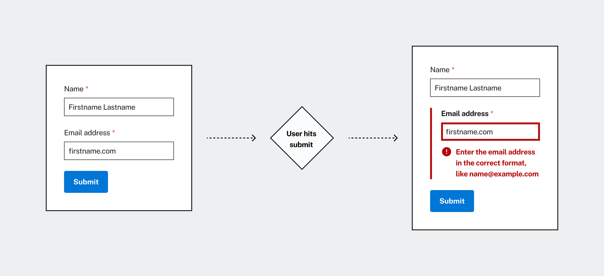
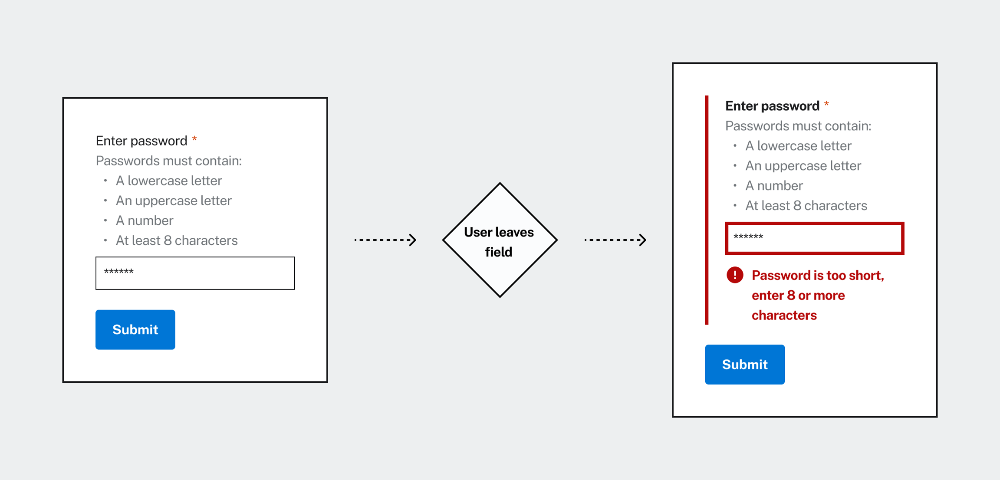
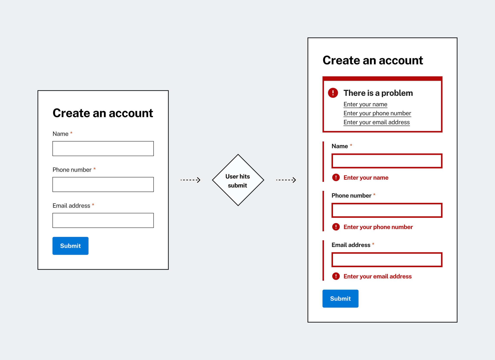

**Use error validation to help users identify, navigate, and recover from errors.**

✅ _Passed WCAG 2.1 AA (USWDS component)_

## Error Validation Usage

### ✔️ What to do

- Always validate forms after a user action, such as Continue, Save, or Submit.
- Use an error summary when a form has 3 or more errors.
- Validate form fields with complex requirements when losing focus (also referred to as on blur)
- When validating on blur, only do so if content has been added or changed.

### ❌ What not to do

- Do not validate form fields in real-time.
- Do not validate empty form fields, unless content has been removed from them.

## Usage Guidance

### Validate on user action

The default pattern for validation is after a user performs an action in a form, such as 'Continue',
'Save,' or 'Submit'. In most cases, this action is triggered by a button.

When validating after an action, it is important to manage focus for assistive technology users.
Take the following into account:

When there are 1-2 errors on a form, focus should be sent to the first field with an error.

When there are 3 or more errors in a form, an error summary should be used. The error summary should
receive focus once it is displayed.

### Validation on blur

For form fields that are likely to cause errors, it can help to show an inline alert once the field
loses focus (on blur). Forms may be more likely to lead to errors if they have complex formatting
requirements, or if they are unique to the context, and unfamiliar to most users.

Some examples may include:

- Passwords that require formatting with case, numbers, and special characters.
- A unique identifier, such as a case number with specific formatting.
- A feedback form with a character limit.

When possible, avoid validating on blur for common fields like names, phone numbers, and email
addresses. On blur validation can be disruptive and easily missed for assistive technology users. It
should be considered for highlighting important errors, not as the default form of validation.

### Multiple errors

Use an error summary when a form has three or more errors. The error summary is triggered on submit,
and should receive focus when it appears.

An error summary should follow a main heading on the page, either the H1, or the most relevant
heading to the form.

### 🚫 Known Issues

**For help with known issues, please reach out to the platform team.**

_The error summary is currently being worked on. When the work is completed, components will be
available in Figma and Code._

## Resources

### Best Practice Guides

| File                                                                                                                | Purpose                                                                                                  |
| ------------------------------------------------------------------------------------------------------------------- | -------------------------------------------------------------------------------------------------------- |
| [Exposing field errors - Adrian Roselli](https://adrianroselli.com/2023/04/exposing-field-errors.html)              | Overview of exposing field errors programmatically and using ARIA to convey them to screen reader users. |
| [A Guide to Accessible Form Validation](https://www.smashingmagazine.com/2023/02/guide-accessible-form-validation/) | Usabilty and accessibilty in forms                                                                       |
