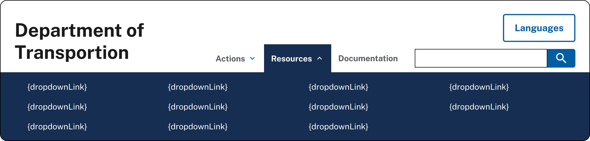
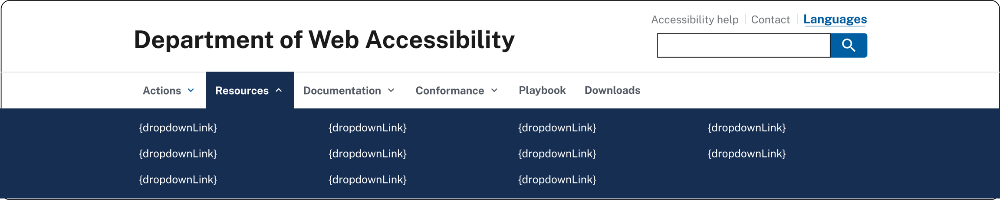
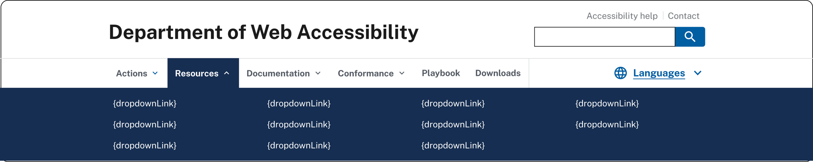
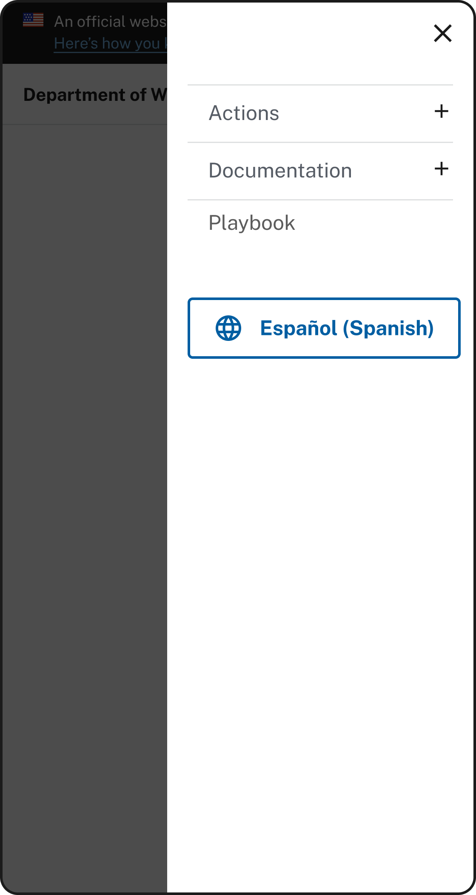
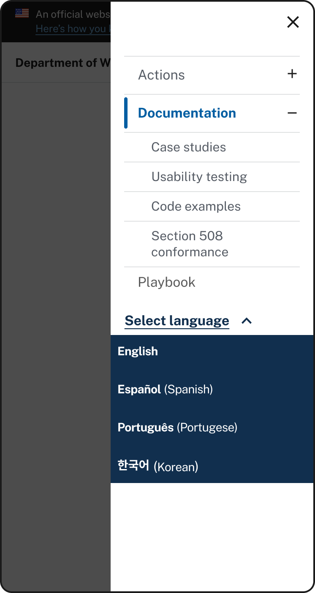

import { STORYBOOK_BASE_URL } from '@config/storybook';

<ComponentHeader
  name="Language Selector"
  category="COMPONENTS"
  description="The consistent placement, interface, and behavior of the language selection component allows users to easily find and access content in the language the user is most comfortable in."
  figmaUrl="https://www.figma.com/design/z8CI77qQvbffkCslHANatK/Grove--Garden-State-Design-System?node-id=1726-757&p=f&t=kIkWUxaAUytHfoIV-0"
  storybookUrl={`${STORYBOOK_BASE_URL}/?path=/docs/components-language-selector--docs`}
/>

<iframe 
    title="Interactive preview of the language selector from Storybook" 
    frameborder="0" 
    src={`${STORYBOOK_BASE_URL}/iframe.html?id=components-language-selector--simple-toggle&viewMode=story`} 
    loading="lazy"
    class="grove__iframe width-full border border-base-light">
</iframe>

 🔗<a href={`${STORYBOOK_BASE_URL}/?path=/docs/components-language-selector--docs`}>View language selector in Storybook</a>

## Language Selector - 2 languages

<iframe 
    title="Interactive preview of the language selector from Storybook" 
    frameborder="0" 
    src={`${STORYBOOK_BASE_URL}/iframe.html?id=components-language-selector--simple-toggle&viewMode=story`} 
    loading="lazy"
    class="grove__iframe width-full border border-base-light">
</iframe>

 🔗<a href={`${STORYBOOK_BASE_URL}/?path=/docs/components-language-selector--docs`}>View language selector in Storybook</a>

### Usage
#### Use this component for:
<IconList>
    <IconListItem icon="check">
        **Two languages are available.** Help users find information in their preferred language when equivalent translated content is available in two languages.
    </IconListItem>
</IconList>

#### Use something else for:
<IconList>
    <IconListItem icon="close">
        **Limited translated content is available.** Consider using something else if the entirety of your content is not translated to a second language.
    </IconListItem>
    <IconListItem icon="close">
        **When content is available in three or more languages** — see the language selector with three or more languages pattern.
    </IconListItem>
</IconList>

### Content guidelines
- **Capitalize the name of each language** (for example, English, Español).
- **Toggle behavior:** When using the language button as a toggle, the button copy should represent the inactive language.
- **Strongly consider labeling the name in the common, native language** like Español (Spanish) or 简体字 (Chinese - Simplified).
- **Do not use flags or country codes** to indicate languages. Flags do not map to languages; Arabic, for example, is spoken in many countries. The country code ES may not be universally understood to indicate Spanish.

### Figma properties 
| Property | Value |
| ----------- | ----------- |
| language | (en) English, (es) Spanish |
| button type | secondary, tertiary |

### Accessibility guidance
Use the [USWDS language selector accessibility tests](https://designsystem.digital.gov/components/language-selector/accessibility-tests/) to test language selector implementation.
- **Color contrast:** There should be enough color contrast between the button, the text inside the button, and the background to ensure readability.
- **The language of each page should be identified using the HTML lang attribute** (`<html lang="en">`, for example). Please see [H57: Using the language attribute on the HTML element](https://www.w3.org/WAI/WCAG21/Techniques/html/H57.html).

## Language Selector - 3+ languages

<iframe 
    title="Interactive preview of the language selector from Storybook" 
    frameborder="0" 
    src={`${STORYBOOK_BASE_URL}/iframe.html?id=components-language-selector--dropdown-menu`} 
    loading="lazy"
    class="grove__iframe width-full border border-base-light">
</iframe>

 🔗<a href={`${STORYBOOK_BASE_URL}/?path=/docs/components-language-selector--docs`}>View language selector in Storybook</a>

### Usage
#### Use this component for:
<IconList>
    <IconListItem icon="check">
        **Content is available in three or more languages.** Use this component if your site offers equivalent content in three or more languages.
    </IconListItem>
</IconList>

#### Use something else for:
<IconList>
    <IconListItem icon="close">
        **Incomplete content translations.** If your site includes content in three or more languages but the majority of content is not available in each language.
    </IconListItem>
    <IconListItem icon="close">
        **When content is available in only two languages** — see the language selector with two languages pattern.
    </IconListItem>
</IconList>

### Content guidelines
- Label the dropdown menu **Languages** or **Select languages**.
- **Capitalize** the name of each language (for example, English, Español).
- **Strongly consider labeling the name in the common, native language**, like Español (Spanish) or 简体字 (Chinese - Simplified).
- **Order the languages alphabetically by the common, native language name.** For example: العربية (Arabic),  简体字 (Chinese - Simplified), English, Español (Spanish), Français (French), Italiano (Italian), Pусский (Russian) 
- Do not use flags or country codes to indicate languages. Flags do not map to languages; Arabic, for example, is spoken in many countries. The country code ES may not be universally understood to indicate Spanish.

### Figma properties 
| Property | Value |
| ----------- | ----------- |
| button type | secondary, tertiary |
| state | closed, open |

### Accessibility guidance
Use the [USWDS language selector accessibility tests](https://designsystem.digital.gov/components/language-selector/accessibility-tests/) to test language selector implementation.
- **Color contrast:** There should be enough color contrast between the button, the text inside the button, and the background to ensure readability.
- **The language of each page should be identified using the HTML lang attribute** (`<html lang="en">`, for example). Please see [H57: Using the language attribute on the HTML element](https://www.w3.org/WAI/WCAG21/Techniques/html/H57.html).
- **All logically related items/links must be presented as an HTML unordered list.** Please see [H48: Using ol, ul and dl for lists or groups of links](https://www.w3.org/WAI/WCAG21/Techniques/html/H48.html).
- **Language links should contain a span element with the lang attribute.** Every language link in the language selector dropdown that is different from content of the current page, should be defined using the lang attribute on a `` tag wrapping the relevant text (e.g., `Hola means Hello.`). Please see [H58: Using language attributes to identify changes in the human language](https://www.w3.org/WAI/WCAG21/Techniques/html/H58.html).

## How to use this component

### General implementation
- Make the language access button a single, independent element. (Note the language selector buttons are built using the Grove button component as the base)
- Include the language dropdown in the header so that it remains visible and in the same position as the user scrolls up and down a webpage if the website has a “sticky” or “fixed” header.
- Take users to an equivalent page that includes the same or similar content.
- Do not create a dead end for users by taking them to a page with little or no meaningful content.
- Avoid auto-redirecting language based on detecting location or browser settings. This can be confusing and disorienting.
- Do not combine this element with other navigation items.

### Using an icon with the language selector
- The language selector component is built using the Grove button as a sub-component and so can be configured to use a leading icon.
- Using an icon with your language selector is completely optional.
- When implementing with an icon, it is advised to only use the globe icon titled ‘language’ in Grove. This is a widely adopted pattern across the web for language translation.
- Avoid using flag icons with the language selector. Flags represent countries, not the languages spoken within them, and may cause confusion or offense with your users.
- Note: There are some usability issues when using this icon.
  - A globe icon may not be universally understood as a signifier to change language preferences. This may lead to incorrect usage or hesitation
  - Icons can be small, especially on mobile, which could make it difficult to tap.
  - To avoid these errors, always use an icon with text to provide clarity and context.

### Language selector placement 
For the best experience, place your language selector in a prominent area of your application. Headers or above-the-fold areas are widely adopted for this reason. Side menus on mobile can also be used; however, this impacts the visibility of the language selector.

#### Web - Navigation Banner

Use the secondary styling button as the default.

Link styling can be used when the language controls need to be placed in a section with other links

Icons with the link variant can make the language selector more distinct in a crowded UI.

#### Mobile - Side navigation 

Use the secondary button style side menu as a toggle when only two languages are available.

Link styling can be used when multiple language options are available. In this implementation, the dropdown list frame should span the width of the side menu to create a visual distinction between the navigation and language lists.

### Application-specific vs site-wide language setting
Embedding tools onto existing websites requires special consideration regarding language settings and controls. Don’t force users to hunt for different language settings between the site and the tool. If there’s a need for two language selectors, make sure to indicate which settings affect which part of the website. To provide the best experience for consistency and control for your users, consider the following:

| Evaluate | Then |
| ----------- | ----------- |
| Does the site already provide a language switcher that affects all content? | If yes, default to site selector unless the tool has specific requirements. |
| Is the tool dynamically loading content in a way that needs language-specific data? | If the tool is using a separate CMS or needs to accommodate languages or a multi-lingual content strategy beyond the scope of the site-specific control, then use a separate language selector. |
| Can the tool detect and adapt to the site's language setting? | If yes, then avoid using a separate selector to minimize user error/confusion. |

## Resources
### Grove links 
| File | Purpose | 
| ----------- | ----------- |
| [Figma Grove: Language selector](https://www.figma.com/design/z8CI77qQvbffkCslHANatK/NJ-Web-Design-System?node-id=1726-757&p=f&t=EahLs7a5O0K1GABw-0) | Using in designs |
| [Storybook: Language selector](https://storybook.grove.nj.gov/?path=/docs/components-language-selector--docs) |  Code snippet, interactive preview |

### USWDS links 
| File | Purpose | 
| ----------- | ----------- |
| [USWDS: Language selector](https://designsystem.digital.gov/components/language-selector/) | Reference for additional styles and functionalities  |
| [USWDS: Language selector accessibility tests](https://designsystem.digital.gov/components/language-selector/accessibility-tests/) | Accessibility tests to run for component |

